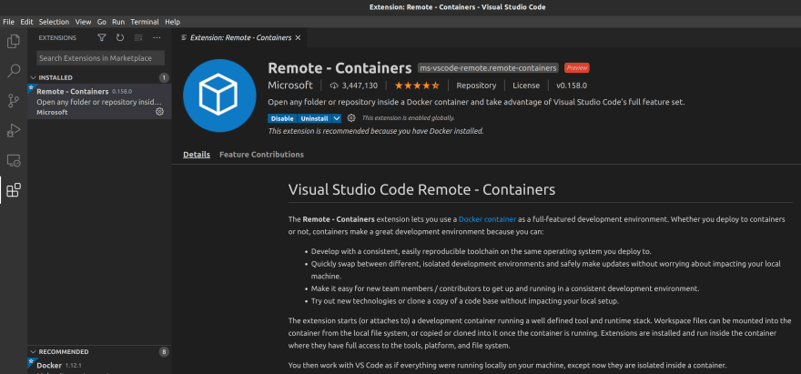
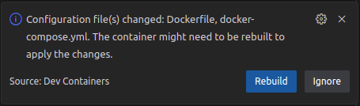

# deploily-frontend
Frontend for deploily platform


## Prerequisite 

* Visual Studio code [https://code.visualstudio.com/](https://code.visualstudio.com/)
* A working installations of Docker and Docker compose
    - [https://docs.docker.com/engine/install/](https://docs.docker.com/engine/install/)

## Clone the repo

```sh
git clone git@github.com:deploily/deploily-frontend.git
cd deploily-frontend
```

## Project setup using VSCode

Start VSCode 
```bash
code .
```

In the Extensions menu, search for "Remote - Containers" and install it:



If VSCode dont detect the remote container: 
- open the Command Palette (usually Ctrl or Command + Shift + P) 
- and type ">Remote-Containers: Open Folder in Container", 
- select it and choose the location of this project.

If you are prompted to Rebuild the container do it: 


If the **Rebuild** prompt don't shows up : 
- open the Command Palette (usually Ctrl or Command + Shift + P) 
- and type ">Remote-Containers: Rebuild Container", 
- select it.

## Developement
First run or after adding new packages 
```bash
cd deploily-frontend
npm install
```

Run in developement mode 
```bash
cd deploily-frontend
npm run dev
```

Open [http://localhost:3000](http://localhost:3000) with your browser to see the result.

Check build 
```bash
cd deploily-frontend
npm run build
```


## Useful links


